# Team Tasks v1.5 - アーキテクチャドキュメント

このドキュメントは、Team Tasks v1.5アプリケーションの仕様と連携をMermaid図で可視化したものです。

## 目次
1. [システム全体構成](#システム全体構成)
2. [コンポーネント階層](#コンポーネント階層)
3. [データモデル](#データモデル)
4. [認証・認可フロー](#認証認可フロー)
5. [タスク操作フロー](#タスク操作フロー)
6. [タスクステータス遷移](#タスクステータス遷移)
7. [外部サービス連携](#外部サービス連携)
8. [デプロイメントフロー](#デプロイメントフロー)

---

## システム全体構成

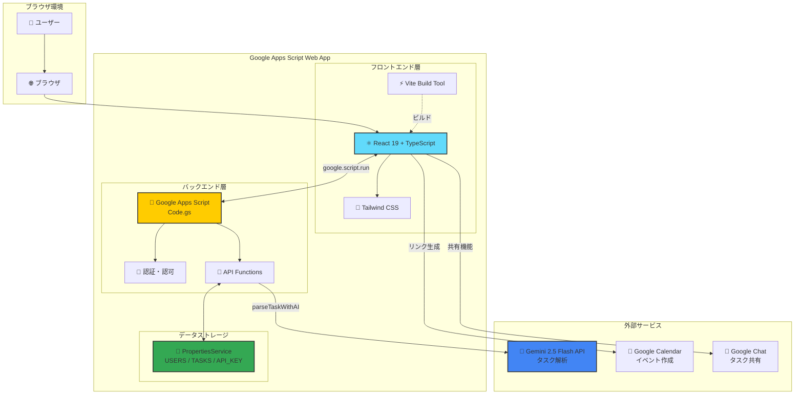

---

## コンポーネント階層

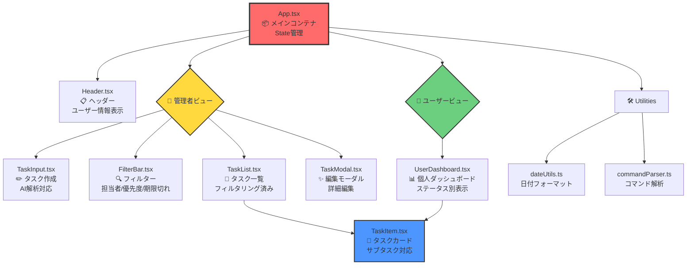

---

## データモデル

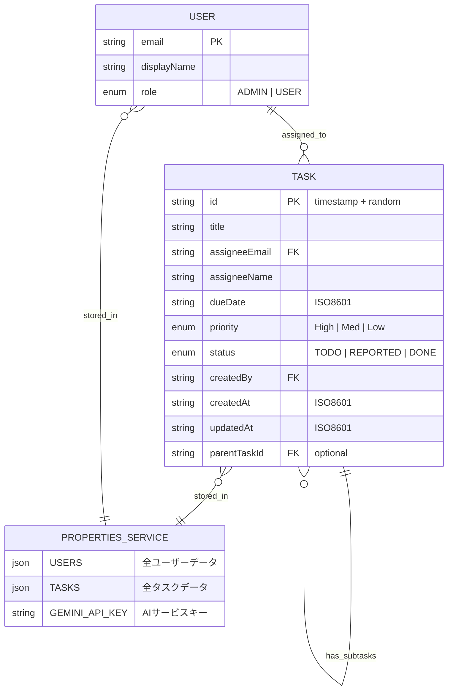

---

## 認証・認可フロー

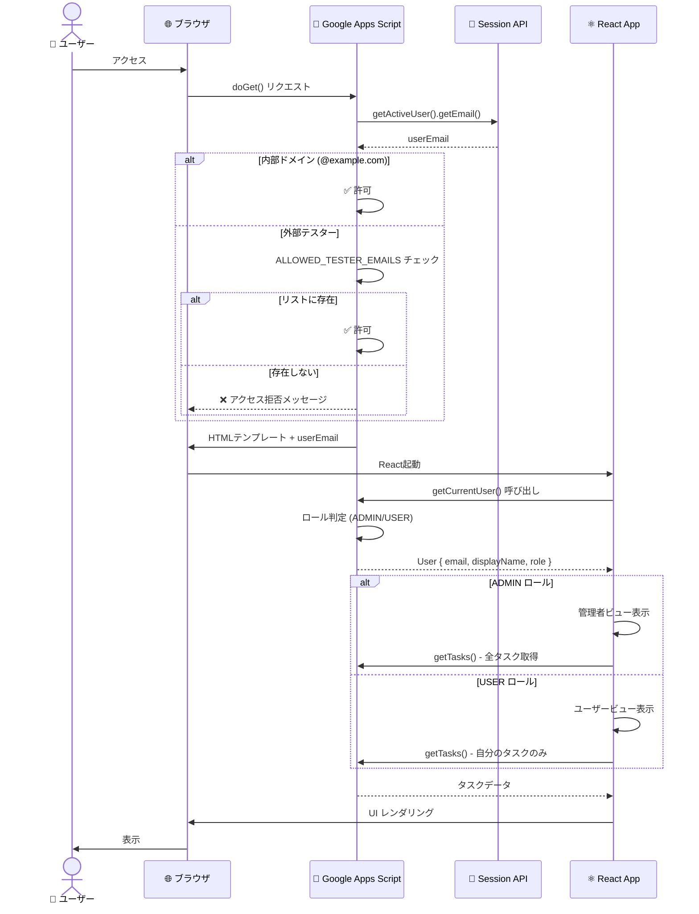

---

## タスク操作フロー

### 管理者：タスク作成フロー

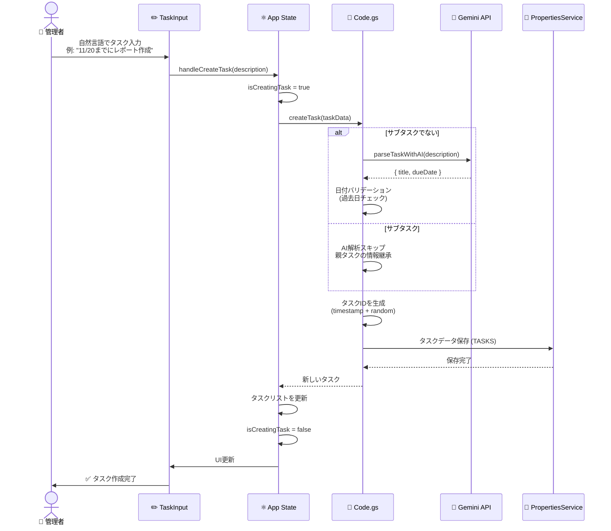

### ユーザー：タスク完了報告フロー

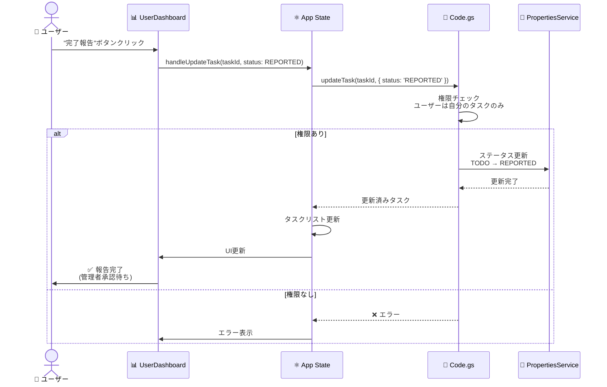

### 管理者：完了承認フロー

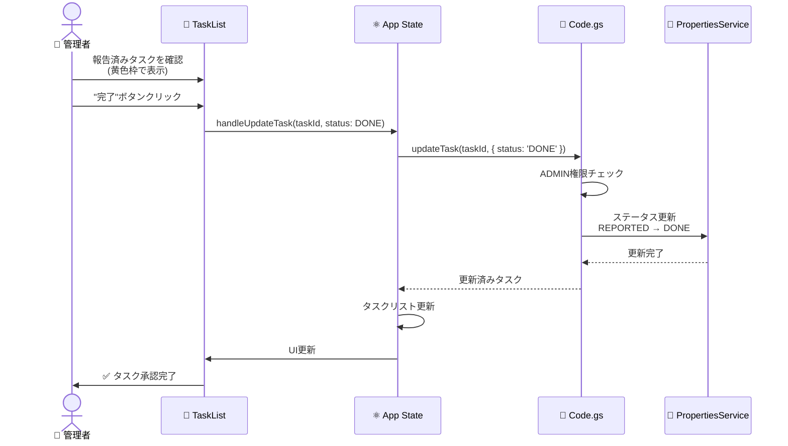

---

## タスクステータス遷移

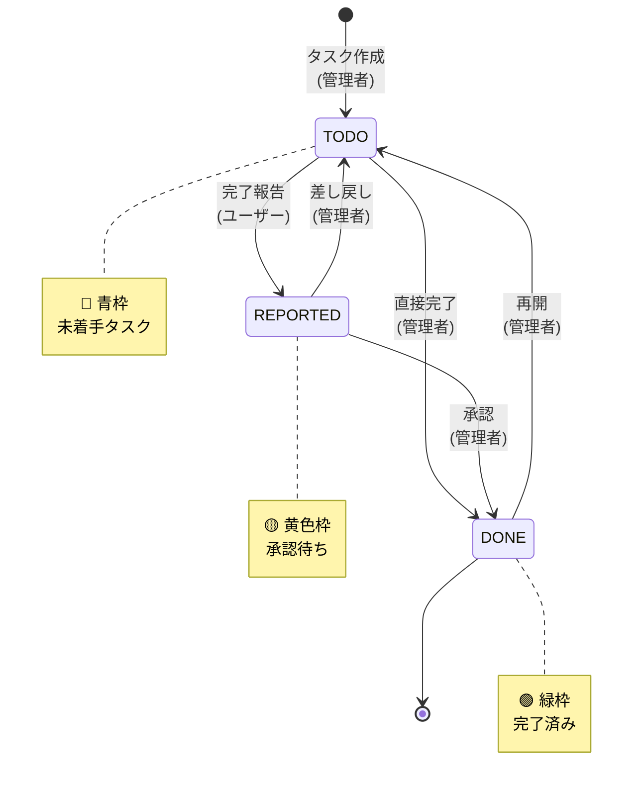

---

## 外部サービス連携

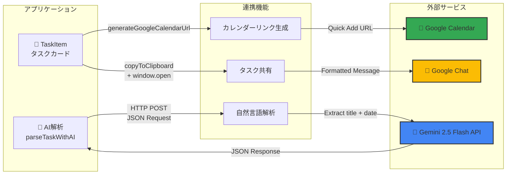

### Gemini API 連携詳細

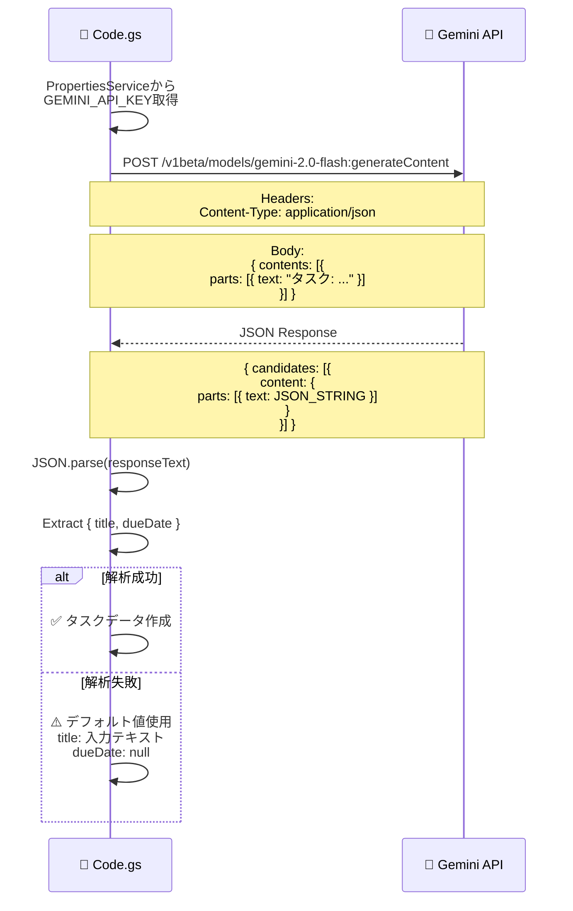

---

## デプロイメントフロー

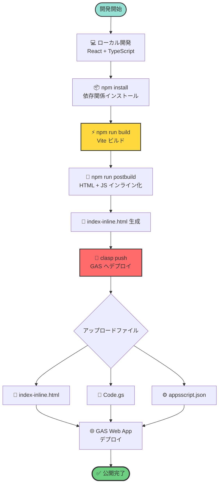

### ビルド設定詳細

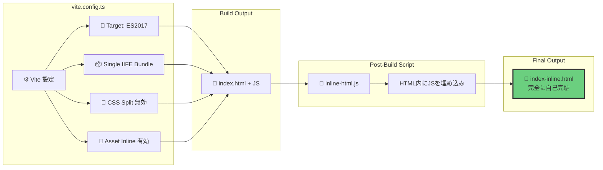

---

## 技術スタック概要

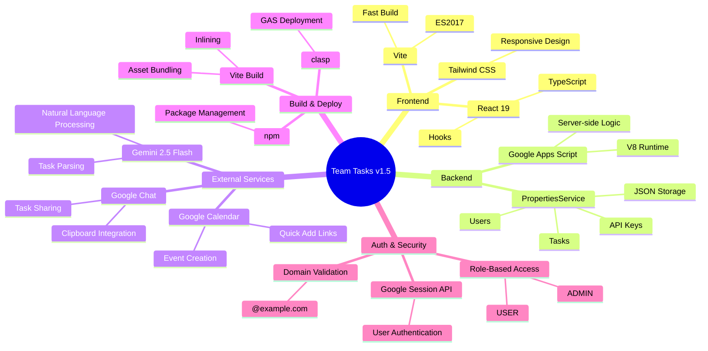

---

## まとめ

このアーキテクチャドキュメントは、Team Tasks v1.5の以下の側面を可視化しています：

1. **システム全体構成**: フロントエンド（React）、バックエンド（GAS）、外部サービスの連携
2. **コンポーネント階層**: React コンポーネントの構造と責務
3. **データモデル**: User、Task、PropertiesService の関係
4. **認証・認可フロー**: ユーザー認証とロールベースアクセス制御
5. **タスク操作フロー**: 作成、更新、削除の具体的な処理フロー
6. **タスクステータス遷移**: TODO → REPORTED → DONE のワークフロー
7. **外部サービス連携**: Gemini AI、Google Calendar、Google Chat との統合
8. **デプロイメントフロー**: ローカル開発から本番デプロイまでのプロセス

これらの図により、システムの全体像と各部分の役割が明確になります。
